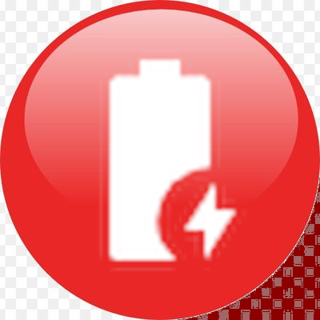
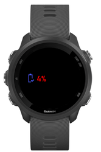
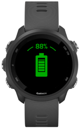
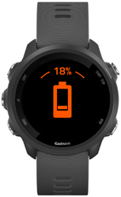
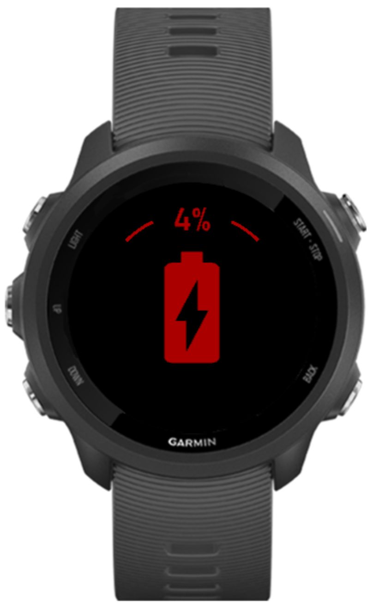

# Minimal Battery Widget for Garmin forerunner

Glance view

A specific miniaml widget for read a battery level

Battery level is inferior of 20% 

Battery level is inferior of 10% 

## Installation

copy of Build/MyMinimalFaceMinimalBatteryWidget.prg in your watch (/GARMIN/APPS/)

