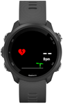

# Minimal Data Widget for Garmin forerunner

View data value of parameter

- Heart
- Battery Body
- Calorie
- Active minute of week
- Distance
- Battery

with heart and battery body we have a graphic

## Installation

copy of Build/MyMinimalFaceMinimalBatteryWidget.prg in your watch (/GARMIN/APPS/)

